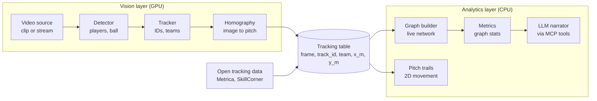

# Sports Graph

Sports Graph detects and tracks players, builds a live player network, visualizes movement on a 2D pitch, and provides tactical explanations using an LLM.

## Project Status

**Current Phase (Phase 0):** Tooling and CI are established. Core modules (detection, tracking, and analytics) are currently in the planning phase.

## Architecture



### Key Principles

- **Strict Separation:** The Vision and Analytics layers are strictly decoupled and never import one another.
- **Data Contract:** Communication occurs exclusively through the central tracking table (`frame`, `track_id`, `team`, `x_m`, `y_m`).
- **Hardware Allocation:** The Vision layer is optimized for GPU, while the Analytics layer utilizes the CPU.
- **Modularity:** The Analytics layer can be developed and tested using pre-labeled tracking data before the detector is functional. Additionally, the detector can be swapped without modifying the Analytics logic.

## Getting Started

### Prerequisites
- [Git](https://git-scm.com/)
- [uv](https://github.com/astral-sh/uv)

### Installation

```bash
git clone https://github.com/nativ670/sports-graph.git
cd sports-graph
uv sync
uv run pytest
```

## Development

```bash
uv run pre-commit install
uv run ruff check .
uv run ruff format .
uv run pytest
```

### Pull Request Workflow

1. Branch from `main`.
2. Open a Pull Request.
3. CI and tests must pass in order to merge.

For detailed project guidelines, refer to [AGENTS.md](AGENTS.md). (`CLAUDE.md` and `GEMINI.md` serve as pointers to this main document.)

## Roadmap

- [x] **Phase 0: Tooling** - Setup repository, uv, ruff, pytest, pre-commit, CI, and agent instructions.
- [ ] **Phase 1: Analytics** - Load open tracking data, apply Pandera validation, build graphs, and draw pitch trails. *Definition of Done (DoD): Metrics compute on a match and baselines indicate meaningful results.*
- [ ] **Phase 2: Detection** - Implement pretrained detector, fine-tune, and evaluate on a match-level split. *DoD: mAP is reported per camera, and failure cases are catalogued.*
- [ ] **Phase 3: Tracking and Homography** - Implement ByteTrack-style tracking, team assignment, and pitch keypoints to output the tracking table. *DoD: Output table metrics generally match open data on similar footage.*
- [ ] **Phase 4: Streaming** - Replay-as-stream functionality, establish a latency budget per stage, and build a live dashboard (Streamlit or Matplotlib). *DoD: Ability to measure "stage X costs N ms per frame".*
- [ ] **Phase 5: LLM Layer** - Deploy an MCP server exposing metrics as tools, and integrate a narrator running on a slow timer. *DoD: Narration statements correctly align with the read numbers.*
- [ ] **Phase 6: Hardening** - Create Dockerfile, model card, finalize architecture documentation, and issue a release tag. *DoD: Cloning the repository and running a demo clip works seamlessly.*

## License

MIT - See [LICENSE](LICENSE) for details.
