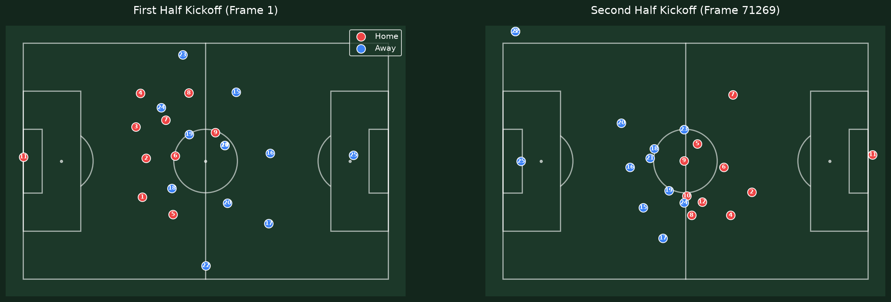
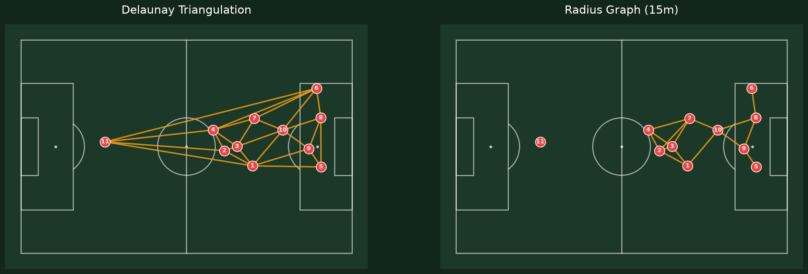

# Phase 1 Findings

Analytics built on open tracking data (Metrica Sports' Sample Game 1), before any
detector exists. Definition of done for this phase: metrics compute on a full
match, and baseline comparisons show which of them are actually meaningful.

## Data quality

Four real issues turned up while building the adapter and diagnostics, none of
which needed special-casing beyond what's described below.

**Substitution placeholders.** At the exact frame a substitution happens, Metrica's
tracking briefly assigns the outgoing and incoming player identical coordinates.
This happened 3 times in the match (of 145,006 frames), always producing a
momentary 12th "player" for one team. Both duplicate rows are dropped in the
adapter, since neither position is a reliable observation of either player for
that one frame.

**The half-time period boundary isn't a real time gap.** Frame numbers don't
reset at half-time, but they also don't reflect the real elapsed time during the
break, frame 71,269 (the first frame of period 2) follows frame 71,268 with no
gap at all in the frame counter, even though roughly 15 real minutes passed.
Any calculation involving elapsed time (speed, in particular) has to treat this
one frame specially. `MatchMeta.period_boundary_frames`, derived from the raw
`Period` column, exists to make this an explicit, queryable fact rather than a
hidden assumption.

**433 isolated tracking glitches.** Comparing each player's frame-to-frame
displacement against a maximum plausible human sprint speed (12 m/s) flags 433
transitions across the match, excluding the half-time boundary itself.
These are scattered across 427 distinct frames, one or two players at a time,
consistent with ordinary tracking noise rather than any single systemic problem.

**One anomalous, self-correcting event.** At frames 71,269–71,278, two players
from *different* teams (home #3, away #22) land on identical off-pitch
coordinates (3.4m past the touchline, within the contract's tolerance margin)
at the exact half-time restart, and drift together for several frames before
separating. The most likely explanation: a real object near the touchline
(staff, a substitute) was picked up independently by each team's tracker at
the same moment. Rare (10 frames total) and self-correcting; noted here rather
than specially handled.

## Visuals

Two ways of turning one frame of tracking data into a graph. Delaunay always
produces a connected mesh; a fixed-radius graph (15m) can leave a player
isolated if their nearest teammate is just outside the radius, here, the
goalkeeper.

*(If a kickoff/pitch image was saved from Step 4, add it above this one, with
a sentence noting the kickoff formation and the half-time side-swap sanity
check.)*

## Graph metrics vs. a null model

To determine whether our graph metrics capture genuine, coordinated team
shapes rather than just the sum of individual player heatmaps, we compared
**10,000 randomly sampled real frames** against **10,000 shuffled surrogates**.

A surrogate frame keeps the same players on the pitch, but replaces each
player's position with their own position from a randomly chosen moment
elsewhere in the match. This destroys any real-time coordination between
players while preserving each individual player's natural roaming range. This
supersedes a simpler check we originally considered (correlating each metric
against a geometric baseline like mean pairwise distance): the null model asks
the sharper question of whether real coordination adds anything *beyond* each
player's own normal spread, rather than just whether a metric tracks spread at
all. We ran a Mann-Whitney U two-sample test (two-sided) for significance.

### Robustness check: the goalkeeper effect

Because the goalkeeper tends to stay isolated near their own goal (a small
positional range compared to outfielders), shuffling their position often
leaves them in roughly the same area. Including them mechanically drags down
graph density and connectedness in a way that has nothing to do with outfield
tactics. To check our metrics are detecting team shape and not just "the
goalkeeper is always isolated," we ran the test both with **all 11 players**
and on just the **10 outfield players**. *(Metrica's tracking data has no
ground-truth player roles, so the goalkeeper was identified algorithmically:
the player with the lowest positional variance within each half of the match.)*

---

### 1. Radius graph (15m threshold)

**All 11 players**

| Metric | Real Mean (± std) | Shuffled Mean (± std) | MWU p-value | Significance |
| :--- | :--- | :--- | :--- | :--- |
| Density | 0.2311 (± 0.1371) | 0.1271 (± 0.0511) | 0.000e+00 | Significant |
| Mean Degree | 2.2999 (± 1.3679) | 1.2662 (± 0.5099) | 0.000e+00 | Significant |
| Largest Component Frac | 0.6744 (± 0.2064) | 0.4131 (± 0.1520) | 0.000e+00 | Significant |
| Algebraic Connectivity | 0.1094 (± 0.7603) | 0.0002 (± 0.0066) | 1.032e-106 | Significant |

**10 outfield players (robustness)**

| Metric | Real Mean (± std) | Shuffled Mean (± std) | MWU p-value | Significance |
| :--- | :--- | :--- | :--- | :--- |
| Density | 0.2671 (± 0.1442) | 0.1387 (± 0.0626) | 0.000e+00 | Significant |
| Mean Degree | 2.3907 (± 1.2908) | 1.2437 (± 0.5621) | 0.000e+00 | Significant |
| Largest Component Frac | 0.7240 (± 0.2137) | 0.4362 (± 0.1663) | 0.000e+00 | Significant |
| Algebraic Connectivity | 0.1832 (± 0.8087) | 0.0012 (± 0.0222) | 0.000e+00 | Significant |

**Takeaway.** The radius graph strongly detects coordinated behavior, and this
signal easily survives removing the goalkeeper. Density and largest-component
fraction both rise when analyzing only the outfield (72% connected vs. 67%
with the GK), confirming the keeper was dragging down the averages. When
players roam independently (the surrogate), the team fractures into isolated
islands far more often.

*Statistical note:* in the radius graph, the shuffled surrogate almost always
fragments into disconnected components, driving its algebraic connectivity to
nearly 0.0. A rank-based test is on shakier ground comparing a continuously
distributed real metric against a near-constant baseline with near-zero
variance. The conclusion holds, the real graph is connected and the surrogate
isn't, but the p-value itself should be read with that caveat.

---

### 2. Delaunay triangulation

**All 11 players**

| Metric | Real Mean (± std) | Shuffled Mean (± std) | MWU p-value | Significance |
| :--- | :--- | :--- | :--- | :--- |
| Density | 0.4392 (± 0.0222) | 0.4405 (± 0.0220) | 7.197e-13 | Significant |
| Mean Degree | 4.3701 (± 0.1700) | 4.3832 (± 0.1841) | 1.692e-11 | Significant |
| Largest Component Frac | 1.0000 (± 0.0000) | 1.0000 (± 0.0000) | NaN | Not significant |
| Algebraic Connectivity | 1.5174 (± 0.2548) | 1.4569 (± 0.3027) | 1.373e-56 | Significant |

**10 outfield players (robustness)**

| Metric | Real Mean (± std) | Shuffled Mean (± std) | MWU p-value | Significance |
| :--- | :--- | :--- | :--- | :--- |
| Density | 0.4596 (± 0.0268) | 0.4764 (± 0.0252) | 0.000e+00 | Significant |
| Mean Degree | 4.1143 (± 0.1871) | 4.2656 (± 0.1960) | 0.000e+00 | Significant |
| Largest Component Frac | 1.0000 (± 0.0000) | 1.0000 (± 0.0000) | NaN | Not significant |
| Algebraic Connectivity | 1.4285 (± 0.2740) | 1.5770 (± 0.3171) | 7.488e-280 | Significant |

**Takeaway.** Because Delaunay always builds a planar mesh spanning the whole
team, the largest component is always 100%, by construction, not because of
anything tactical. More interesting: real shapes actually yield slightly
*lower* density/mean degree than the randomized blobs, suggesting real
formations put more players on the convex-hull boundary (distinct
defensive/attacking lines) than a randomized cloud would. This effect is more
pronounced once the goalkeeper is removed (real mean degree 4.11 vs. shuffled
4.26).

---

### Conclusion

The 10,000-sample test is consistent with the hypothesis that this graph
approach detects macro-level team coordination invisible to individual player
heatmaps. Removing the perpetually-isolated goalkeeper confirms the radius
graph's signal is driven by genuine outfield shape, not goalkeeper isolation.
It's worth separating statistical significance from effect size: every metric
here is significant given the sample size, but the Delaunay algebraic
connectivity result in particular only became detectable *because* of the
large N, and represents a subtle structural shift, not a large one. None of
this is a causal claim about tactics or outcomes, only that real positional
data carries structure a randomized version of the same data doesn't.

## What we'd test next

Not part of this phase, listed here so they aren't lost:

- **Node-removal perturbation.** Remove one player from a frame's graph at a
  time, recompute `algebraic_connectivity` / `largest_component_frac`, and rank
  players by how much their removal hurts team connectivity. Needs nothing new,
  just `build_frame_graph` and the existing metrics, applied differently.
- **Event-anchored break detection.** The downloaded events file (substitutions,
  goals) has never been used. A permutation-based mean-shift test around a known
  event frame avoids the normality assumptions a classical Chow test would need;
  `ruptures` (PELT) would let a metric's change points be *discovered* rather
  than only confirmed at a frame we already suspect.
- **Convex hull area** as a second geometric baseline, alongside mean pairwise
  distance.
- **Player-identity-aware analysis:** specific matchups (a fast winger against
  a given defender), ball possession, goals, and exactly when a defensive line
  breaks. All real and important, but need player identity and ball/event data
  that no current metric uses. Revisit once the ball loader and event data are
  wired in.
- **Pitch control / space-control models** (Voronoi or physics-based) and
  player trajectory prediction ("ghosting") remain noted as possible future
  work past Phase 6, not near-term.
